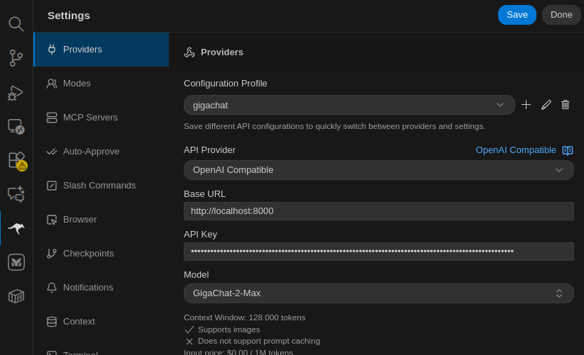

# GPT2GigaChat Proxy

Прокси-сервер для работы с GigaChat API от Сбера через стандартный OpenAI-совместимый интерфейс.

## Установка

### Требования

#### Вариант 1: Docker (рекомендуется)
- Docker и Docker Compose
- Ключ доступа к GigaChat API (получить на [developers.sber.ru](https://developers.sber.ru/))

#### Вариант 2: Локальная установка (Linux/macOS)
- Python 3.8+
- pip и виртуальное окружение
- Ключ доступа к GigaChat API

### Вариант 1: Установка через Docker (рекомендуется)

⚠️ **Важно:** Поскольку образ `ai-forever/gpt2giga` недоступен на Docker Hub, используется локальная сборка через `Dockerfile`.

1. **Скопировать пример конфигурации:**
```bash
cp .env.example .env
```

2. **Добавить учетные данные в `.env`:**
```env
# Получить ключ на https://developers.sber.ru/
GIGACHAT_CREDENTIALS=ВАШ_КЛЮЧ_С_DEVERS_SBER_RU

# Установить API ключ для авторизации клиентов
GPT2GIGA_API_KEY=your-secure-api-key
```

3. **Собрать и запустить сервис:**

Используя Docker Compose (сборка + запуск):
```bash
docker compose up -d --build
```

Или используя Makefile (рекомендуется):
```bash
make up-d
```

4. **Проверить статус:**
```bash
docker compose logs -f gpt2giga
```

Или через Makefile:
```bash
make logs-follow
```

Сервис будет доступен на `http://localhost:8000` (или на порту, указанном в `GPT2GIGA_PORT` в `.env`)

### Вариант 2: Локальная установка (без Docker)

**Шаг 1: Создать виртуальное окружение**

Linux / macOS:
```bash
python3 -m venv .venv
source .venv/bin/activate
```

Windows (PowerShell):
```bash
python -m venv .venv
.venv\Scripts\Activate.ps1
```

**Шаг 2: Установить gpt2giga**

```bash
pip install --upgrade pip
pip install gpt2giga
```

**Шаг 3: Конфигурация**

Создайте файл `.env`:
```bash
cp .env.example .env
```

Добавьте ваши учетные данные:
```env
GIGACHAT_CREDENTIALS=ВАШ_КЛЮЧ_С_DEVERS_SBER_RU
GPT2GIGA_API_KEY=your-secure-api-key
```

**Шаг 4: Запуск сервиса**

```bash
# Загрузить переменные окружения
export $(cat .env | xargs)

# Запустить gpt2giga
gpt2giga
```

Сервис будет доступен на `http://localhost:8000`

## Конфигурация

Вся конфигурация хранится в файле `.env` в виде переменных окружения. Используйте `.env.example` как шаблон.

### Основные параметры

#### Параметры прокси (GPT2GIGA)
| Переменная | Значение | Описание |
|---|---|---|
| `GPT2GIGA_HOST` | `0.0.0.0` | Интерфейс прослушивания |
| `GPT2GIGA_PORT` | `8000` | Порт сервиса |
| `GPT2GIGA_USE_HTTPS` | `False` | Использовать HTTPS |
| `GPT2GIGA_LOG_LEVEL` | `INFO` | Уровень логирования (DEBUG, INFO, WARNING, ERROR) |
| `GPT2GIGA_ENABLE_API_KEY_AUTH` | `False` | Включить авторизацию по API ключу |
| `GPT2GIGA_API_KEY` | `change-me-please` | API ключ для клиентов |

#### Параметры GigaChat
| Переменная | Значение | Описание |
|---|---|---|
| `GIGACHAT_SCOPE` | `GIGACHAT_API_PERS` | Область доступа (для персональных ключей) |
| `GIGACHAT_CREDENTIALS` | `***` | API ключ от Сбера (https://developers.sber.ru/) |
| `GIGACHAT_MODEL` | `GigaChat-2-Max` | Модель для использования |
| `GIGACHAT_PROFANITY_CHECK` | `False` | Проверка профанитета |
| `GIGACHAT_VERIFY_SSL_CERTS` | `False` | Проверка SSL сертификатов |
| `GIGACHAT_TIMEOUT` | `70000` | Таймаут запросов (мс) |

### Изменение конфигурации

1. Отредактируйте `.env` файл
2. Перезагрузите контейнер:
```bash
docker compose restart gpt2giga
```

Изменения применятся автоматически.

## Быстрый старт с Roocode



Roocode поддерживает OpenAI-совместимый интерфейс, поэтому вы можете легко интегрировать GPT2GigaChat прокси:

1. **Откройте Settings в Roocode** (⚙️ в левой боковой панели)

2. **Перейдите в раздел "Providers"**

3. **Нажмите на кнопку "+" для добавления нового провайдера**

4. **Выберите "OpenAI Compatible"**

5. **Заполните следующие параметры:**
   - **Configuration Profile:** `gigachat` (или любое имя по вашему выбору)
   - **API Provider:** OpenAI Compatible
   - **Base URL:** `http://localhost:8000/v1`
   - **API Key:** значение из `GPT2GIGA_API_KEY` в `.env` файле
   - **Model:** `GigaChat-2-Max`

6. **Нажмите "Save"**

7. **Выберите созданный профиль в Roocode** и начните работу с GigaChat через стандартный OpenAI интерфейс

**Примечание:** Убедитесь, что сервис GPT2GigaChat запущен на `http://localhost:8000` перед использованием в Roocode.

**Скриншот конфигурации:** Визуальное представление экрана настроек см. в файле `assets/roocode.png` (источник: [статья на Habr](https://habr.com/ru/articles/972852/))

## Использование

### OpenAI-совместимый интерфейс

```bash
curl -X POST http://localhost:8000/v1/chat/completions \
  -H "Content-Type: application/json" \
  -H "Authorization: Bearer your-api-key" \
  -d '{
    "model": "GigaChat-2-Max",
    "messages": [
      {"role": "user", "content": "Привет!"}
    ]
  }'
```

### Python пример

```python
from openai import OpenAI

client = OpenAI(
    api_key="your-api-key",
    base_url="http://localhost:8000/v1"
)

response = client.chat.completions.create(
    model="GigaChat-2-Max",
    messages=[{"role": "user", "content": "Привет!"}]
)

print(response.choices[0].message.content)
```

## Управление сервисом

### Просмотр логов
```bash
docker compose logs -f gpt2giga
```

### Остановка сервиса
```bash
docker compose down
```

### Перезагрузка
```bash
docker compose restart gpt2giga
```

Или через Makefile:
```bash
make restart
```

### Пересборка образа
```bash
docker compose down
docker compose up -d --build
```

Или через Makefile:
```bash
make rebuild
```

## Безопасность

⚠️ **Рекомендации:**

1. **Авторизация**: Отключена по умолчанию (`GPT2GIGA_ENABLE_API_KEY_AUTH=False`). Включите и установите сильный ключ если прокси доступен не только локально
2. **SSL проверка**: На корпоративных сетях может потребоваться отключить проверку SSL (`GIGACHAT_VERIFY_SSL_CERTS=False`)
3. **Сетевой доступ**: По умолчанию слушает на `0.0.0.0:8000`. Рекомендуется:
   - Использовать за reverse proxy (nginx, Traefik)
   - Ограничивать доступ firewall-ом
   - Использовать HTTPS в production (через `GPT2GIGA_USE_HTTPS=True`)

## Переменные окружения (справка)

Полный список доступных переменных окружения см. в файле `.env.example`. Основные переменные уже показаны в таблице конфигурации выше.

## Типичные проблемы

### Ошибка: "pull access denied for ai-forever/gpt2giga"

Это ошибка означает, что образ недоступен на Docker Hub. **Решение:** используется локальная сборка через `Dockerfile`.

```bash
# Пересобрать образ локально
docker compose up -d --build

# Или через Makefile
make rebuild
```

### Ошибка подключения к GigaChat
- Проверить корректность `GIGACHAT_CREDENTIALS`
- Убедиться, что ключ имеет доступ к API GIGACHAT_API_PERS
- Проверить сетевое соединение

### SSL ошибки
- Если используется корпоративный прокси, установить в `.env`: `GIGACHAT_VERIFY_SSL_CERTS=False`

### Медленные ответы
- Увеличить таймаут в `.env`: `GIGACHAT_TIMEOUT=70000` (значение в миллисекундах)

### Контейнер не запускается

Проверить логи:
```bash
docker compose logs gpt2giga
```

Или через Makefile:
```bash
make logs
```

Частые причины:
- Отсутствует файл `.env` с `GIGACHAT_CREDENTIALS`
- `GIGACHAT_CREDENTIALS` имеет неправильное значение
- Порт (GPT2GIGA_PORT) уже занят другим сервисом

### Изменение порта

По умолчанию сервис слушает на порте **8000**.

Чтобы использовать другой порт:

1. Отредактировать `.env`:
```env
GPT2GIGA_PORT=9000  # Новый порт
```

2. Перезагрузить контейнер:
```bash
docker compose restart gpt2giga
```

Портмаппинг в `docker-compose.yml` автоматически использует переменную `GPT2GIGA_PORT`, поэтому дополнительных изменений не требуется.

## Структура проекта

```
AI/gpt2giga/
├── .env                 # Переменные окружения (не коммитить!)
├── .env.example         # Шаблон переменных окружения
├── .venv/               # Виртуальное окружение Python (локальная установка)
├── Dockerfile           # Конфигурация для сборки Docker образа
├── docker-compose.yml   # Конфигурация Docker Compose
├── Makefile             # Команды для управления сервисом
├── gpt2giga.log         # Логи приложения (создаётся автоматически при локальной установке)
└── README.md            # Этот файл
```

**Примечание:** Начиная с текущей версии, вся конфигурация хранится в `.env` файле через переменные окружения. Файл `config.yaml` остаётся только для обратной совместимости.

## Поддержка

- [Документация GigaChat API](https://developers.sber.ru/docs)
- [Исходный репозиторий gpt2giga](https://github.com/ai-forever/gpt2giga)

## Благодарности

Спасибо [Андрею](https://habr.com/ru/articles/972852/) за подробную статью, на основе которой было подготовлено данное решение. Статья оказалась очень полезной при настройке.

## 👤 Автор

[Dbgops](https://chuyana.ru)

```bash
 _     _
  \___/    SE_Labs
 ( ^_^ )
 /| o |\   🐞 Dbgops
 /|___|\   by Andrey Chuyan
 _/  \_    https://chuyana.ru
```
